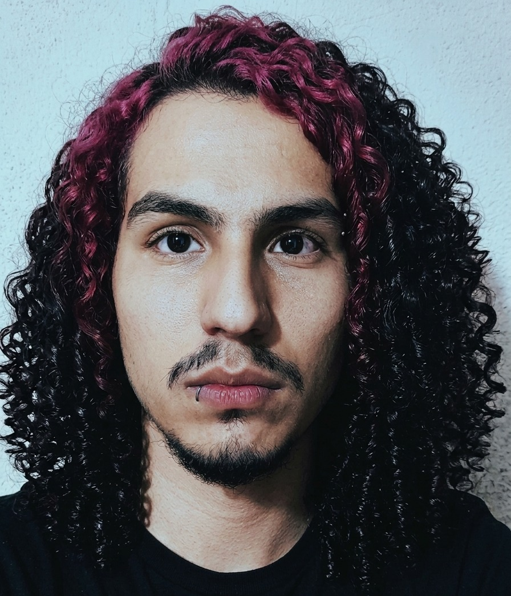

# Reflexión Personal: Mi Camino hacia el Diseño de Videojuegos

## 1. Mis Intereses y Experiencias Previas

He jugado videojuegos toda mi vida y esa pasión me llevó a querer crearlos. He desarrollado pequeños proyectos en Unity, aprendiendo lo básico de programación, mecánicas y lógica de sistemas. Sin embargo, siempre sentí que dominaba el cómo hacer funcionar un juego, pero me faltaba entender el por qué de cada decisión. Esa carencia es lo que me motiva a formarme como diseñador.

## 2. ¿Qué Significa para Mí "Diseñar un Videojuego" en Este Momento?

Ahora entiendo que diseñar no es programar ni hacer arte. Diseñar es decidir qué experiencia emocional quiero provocar y construir las reglas y sistemas necesarios para que eso ocurra.

Implica:
- Priorizar la experiencia del jugador por encima de la tecnología.
- Crear restricciones que generen libertad y decisiones interesantes.
- Diseñar desde la empatía, no desde el ego.

## 3. Cómo Me Imagino Mi Rol como Diseñador Durante el Curso

Quiero pasar de ser un programador solitario a un diseñador reflexivo. Mi rol será:
- **Cuestionar** cada decisión con los "lentes" de Schell.
- **Prototipar con propósito**, justificando cada mecánica más allá de lo técnico.
- **Escuchar críticas** y observar cómo otros viven mis juegos.
- **Fallar rápido** para aprender antes que invertir demasiado en errores de concepto.

Busco construir un puente entre mi intuición de jugador y un enfoque disciplinado de diseño.

---

## Foto 

